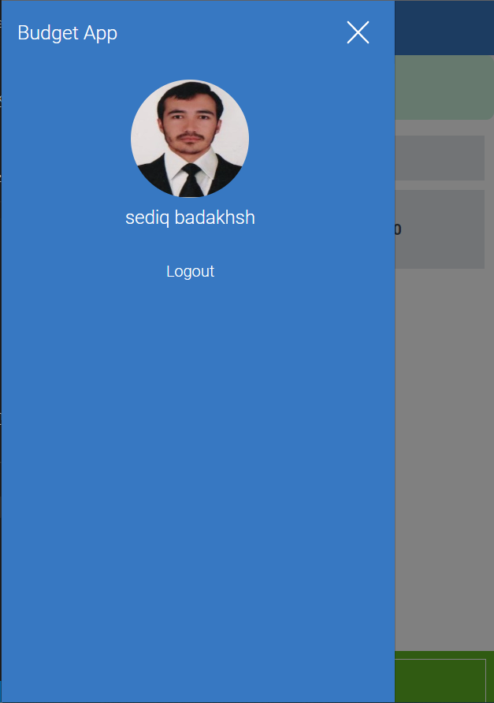

# Bugdet App

> This app allows users to create their categories of spending and add transactions to each category while tracking thier total spending on each category.

- .

## App URL

[Budget App](https://hidden-scrubland-51470.herokuapp.com/)

## Live Demo

[Budget App live dmonistration](https://www.loom.com/share/6440c00d84bc4c98a13aa53cbcf9ca7a)

## Built With

- _**Ruby**_
- _**Rails**_
- _**PostgreSQL**_

## Getting Started

### Clone this repository

```bash
$ git clone https://github.com/sediqullahbadakhsh/recipe-app-group-project.git
$ cd recipe-app-group-project
```

### Install gems

```bash
$ bundle install
```

### Setup database

```bash
$ rails db:create
```

### Start server

```bash
$ rails s
```

Open http://localhost:3000/ in your browser

### Run tests

```bash
$ bundle exec rspec
```

## Authors

<!-- table Variables -->

[@sediqullahbadakhsh]: https://github.com/sediqullahbadakhsh
[@sediqullah]: https://www.linkedin.com/in/sediqullah/

<!-- table Variables -->

| 👤           | **Sediqullah Badakhsh** |
| ------------ | ----------------------- |
| **GitHub**   | [@sediqullahbadakhsh]   |
| **LinkedIn** | [@sediqullah]           |

## 🤝 Contributing

Contributions, issues, and feature requests are welcome!

## Show your support

Give a ⭐️ if you like this project!

## Acknowledgments

- Hat tip to anyone whose code was used
- Inspiration
- etc

## Credit Design

All credits regarding the design idea of this project goes to the [Creative Commons](https://creativecommons.org/licenses/by-nc/4.0/) and thanks for this beautiful design.
